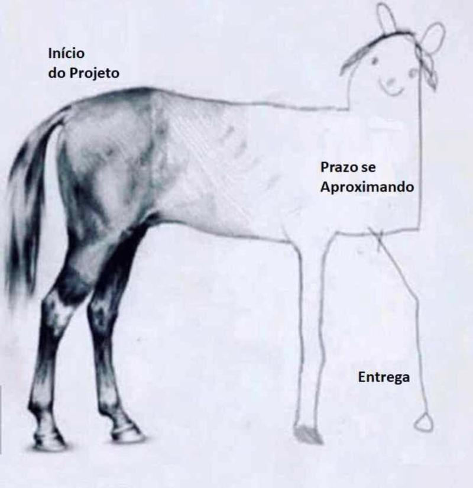

Alguns pontos a respeito do Trabalho de Conclusão de Curso - TCC.

## Enfoque
Inicialmente é preciso entender que um trabalho de conclusão de curso procura:
 - Enfatizar por meio de um trabalho formal, um determinado aprendizado adquirido na Universidade. 
 - Demonstrar domínio deste conteúdo a ser submetido a avaliadores. 
 - Conhecer o modelo de pesquisa e suas características científicas (apresentação temática, revisão bibliográfica, metodologia, etc). 
 - Dominar a escrita formal e sua expressão verbal na apresentação. 

### Tipos

A partir destas referências, devemos entender também a diferença entre [pesquisas](https://pt.wikipedia.org/wiki/Stricto_sensu):

 1. Latu sensu - Ampla (TCCs, pós-graduações) 
 2. Scricto sensu - Estrita, específica (mestrado, doutorado) 

De modo o TCC posiciona-se em um tipo de pesquisa que pode ser considerada "ampla" no sentido de abordar conteúdos correlatos, não exigindo que o pesquisador se dedique a um ponto específico a fim de exaurir determinado enfoque. 
Exemplifica-se: um projeto de TCC pode propor: "A construção de um sistema para avaliação do nível de leitura dos discentes nas universidades". Isso indica que o pesquisador(a) vai precisar consultar diversos elementos teóricos para o desenvolvimento do documento, a exemplo de i) linguagem de programação web, ii) banco de dados, iii) estudo de interface homem x computador, iv) hospedagem do site (deploy), etc... E ainda decidir se há viabilidade para a construção (ou não) de um protótipo que possa exemplicar sua pesquisa. 

Diferente de um trabalho stricto sensu, no TCC o aluno(a) tem muito mais **autonomia** para direcionar o tema. Visto que na grande maioria dos trabalhos de mestrado e doutorado, o aluno(a) segue uma linha de pesquisa de interesse do orientador. Nas pesquisas de conclusão de curso deve haver uma sintonia temática, onde o professor(a) domina determinada área do conhecimento e geralmente proporciona um nível de escolha muito maior ao discente na definição do tópico de pesquisa. 

### Formas de escrita

- **Artigo** - Neste formato, o trabalho é escrito de forma que poderá ser **publicado** em algum periódico da área.
- Modelo tradicional - Neste formato o trabalho é estruturado em grupos bem definidos, no formato acadêmico tradicional para publicações deste tipo de formalidade institucional.

Em ambos os formatos, os tópicos estruturais devem estar presentes (introdução, referencial teórico, justificativa, problema, etc...) porém de formas diferentes devido ao foco de apresentação final do texto. **Prefiro o formato de artigo** porque ele serve para o compromisso da disciplina na universidade e para oportunidades de publicação. Sendo muito mais interessante tanto para o(a) discente quanto para o orientador. E ainda, o orientador também é nomeado no artigo após o(a) discente (primeiro autor(a)), é constrangedor ter que lembrar isso visto que além de uma norma, seria um gesto de consideração à orientação. 

### Áreas 

Em particular, minhas áreas de conhecimento estão relacionadas a: 

 - Desenvolvimento web (front e back end) 
 - Desenvolvimento mobile 
 - Linguagens de programação 
 - Recuperação da informação (indexação, classificação, artefatos de representação do conhecimento) 

### Observações 

Outro detalhe importante é que em uma orientação, deve haver uma confiança mútua entre orientando e orientador. Discentes que já possuem determinado projeto e, digamos, uma auto confiança tal que o impeça de ouvir as orientações, não cria um ambiente saudável. É preferível evitar este tipo de situação, com a liberdade de procurar outro orientador. 
Ter compromisso, atenção aos prazos e entregas, boa comunicação (com educação) evitando atrasos nas respostas e disposição à pesquisa, são ingredientes que contribuem para um bom trabalho. 

Gostaria ainda de fazer uma colocação de forma bem clara: se o(a) discente já aborda o TCC como um "peso", um "fardo" que precisa ser feito apenas para cumprir uma obrigação acadêmica, realmente é melhor evitar a minha orientação. Minha experiência é infeliz com este tipo de perfil, porque a pessoa dedica apenas o "resto" de tempo para o TCC. Ouvir coisas do tipo: "não mexi no TCC porque tive uma reunião importante no trabalho" - então o TCC não é importante?! Ou ainda na reunião semanal: "ok professor, vamos reunir rapidinho..." - rápido porque? há coisas mais importantes e a reunião de orientação (agendada) atrapalha? Definitivamente não é o perfil de pessoa que desejo orientar. 

Importante também ressaltar que o TCC é um trabalho sério como uma dissertação ou tese e *precisa* de investimento em pesquisa ampla e confiável. Portanto, a prática da escrita precisa ser exercitada, é preciso desenvolver os tópicos procurando reunir o máximo de informação relevante sobre o tema, ainda que esteja no formato de artigo. Aliás, o fato de produzir um trabalho no formato de artigo **não** quer dizer que optou-se por um "resumo" ou um formato mais "fácil" para cumprir com a obrigação acadêmica.  

### Fluxo de trabalho

É comum que em um primeiro momento exista a ansiedade de procurar um modelo (template) e já começar a estruturar / escrever algo. Mas é importante definir de forma muito clara, o tema, objetivos, problema e estratégia de pesquisa. Em uma sequência inicial, pode-se considerar: 

 1. Ter um ou mais temas como referências. 
 2. Convidar um professor(a) orientador(a) que tenha conhecimento / interesse no tema. 
 3. Alinhar com o orientador(a) um tópico específico deste tema, baseado nas referências iniciais. 
 4. Realizar uma pesquisa prévia, eficiente, se há algum material (artigo, dissertação, tese) igual ou próximo da temática a ser desenvolvida. [Muito importante]
 5. Definir uma estrutura de trabalho (template de artigo TCC) compartilhada (Drive, Notion, LaTex).
 6. Definir uma agenda de encontros periódicos com entregas alinhadas ao cronograma da universidade. 

### Boas práticas  

Ao iniciar a orientação, de acordo com a disponibilidade de cada um, é importante definir E seguir um *agendamento*, seja semanal ou quinzenal. 
- Caso não possa comparecer às reuniões é importante avisar ANTES. (Aliás, isso independente do âmbito acadêmico, qualquer compromisso precisa de respeito.)  
- Em situações que precisam de algum nível de decisão (principalmente na dinâmica da orientação), na condição de discente, é importante consultar o orientador e não simplesmente levar "definições" para a orientação. 
- Ao receber um material (pdf, comentário, email) envie um retorno por mais simples que seja, isso retira qualquer dúvida sobre uma entrega que vai influenciar na próxima reunião. 
- Avalie sua capacidade de falar em público. Sua defesa mesmo em ambiente online vai demandar um mínimo de desenvoltura e capacidade de expressão. E falar em público não é um "dom" que somente alguns têm, é um treinamento que pode e deve ser desenvolvido. Reflita sobre esse tema com uma entrevista do Eslen: ["Medo de falar em público"](https://www.youtube.com/embed/cnPPPptCD8w?start=133)

### Softwares de apoio

Vou sempre atualizar esta lista, visto que a dinâmica tecnológica permite a criação de novas ferramentas de forma cada vez mais rápida. Inicialmente tenho usado alguns softwares que são realmente úteis na criação / organização da informação: 

 - [Trello](https://trello.com) Um ótimo aplicativo para gestão de tarefas baseado em Kanban.
 - [Evernote](https://evernote.com/intl/pt-br) Idéias, links, sites... anote tudo que for importante para o trabalho com este gerenciador de notas. 
 - [Zotero](https://www.zotero.org) Controle suas referências bibliográficas (artigos, livros) no padrão ABNT. 
 - [Draw.io](https://app.diagrams.net) e [Draw.io-app](https://github.com/jgraph/drawio) Construa mapas mentais, fluxogramas, esquemas gráficos. 
 - [Pencil](https://pencil.evolus.vn) Construa mapas mentais, fluxogramas, esquemas gráficos.  
 - [Excalidraw](https://excalidraw.com) fluxogramas, esquemas gráficos.
 - [Sketch](https://www.sketch.com) Prototipação, criação de interfaces e imagens. (opção de uso livre para contas acadêmicas). 
 - [Figma](https://www.figma.com) Prototipação, criação de interfaces e imagens. (opção de plano simples grátis). 
 - [Whimsical](https://whimsical.com/) Mapas mentais, fluxogramas e estruturas de informação gráficas interessantes. 
 - [GitMind](https://gitmind.com/) Mapas mentais, fluxogramas e estruturas de informação gráficas interessantes. 
 - [Scrivener](https://www.literatureandlatte.com/scrivener/overview) Editor de texto não linear (pago). Comprei, gosto, mas reconheço que para o perfil discente, outros editores gratuitos podem resolver. Mas a sugestão é conhecer o programa e quem sabe usá-lo futuramente. 
 - [Notion](https://www.notion.so/product?fredir=1) De tudo um pouco, permite compartilhar notas, trabalhos (textos) e mais. 
 - Google Drive para o compartilhamento de documentos.  
 - [Lucid](https://www.lucidchart.com/pages/) Cronogramas e esquemas gráficos (opção de conta gratuíta).
 - [GanttProject](https://www.ganttproject.biz) Cronogramas (gráfico de Gantt).
 - [Zoho](https://www.zoho.com/pt-br/projects/) Cronogramas (gráfico de Gantt). 

### Material para apoio 

Também tenho atualizado o seguinte [arquivo](https://github.com/erfelipe/Orientacoes-TCC) no gitHub com orientações importantes e tópicos bem definidos:

- [Arquivo](https://github.com/erfelipe/Orientacoes-TCC) no gitHub

### Desafio

Assim como em diversos projetos, seja um curso, um trabalho, etc... começamos com entusiasmo e certo foco. No decorrer do caminho, o cansaço e outras situações (saúde, outros compromissos) competem e colocam em risco o planejamento inicial.
Para não terminar como o desenho da eguinha, um princípio importante a ser seguido é estabelecer uma agenda de ações semanais. Defina em seu agenda dias e horários onde você deve estar comprometido com o projeto, ainda que possam surgir exceções, essa organização é muito útil para forçar atitudes que contribuam com o bom andamento da pesquisa.   

### O pulo do gato 

 
Tenho convicção que nossa vida consiste em um conjunto de dimensões que precisam estar em equilíbrio para alcançarmos êxito naquilo que temos como objetivo. Cuidar da saúde com uma visão ampla: Prática de esportes; alimentação saudável; hidratação (muita água); dormir bem (forma adequada), são maneiras de respeitar seu corpo e proporcionar um melhor raciocínio. Cuide da sua mente, tenha um [Mindset](https://www.amazon.com.br/Mindset-Carol-S-Dweck/dp/8547000240) focado em coisas boas, cultive otimismo, entenda a lei do retorno (o que você planta, você colhe) e evite as [redes sociais](https://www.erfelipe.com.br/social-media/). Há também a dimensão espiritual: manter a fé em Deus e saber que nossa vida não termina neste mundo, mas que nossas ações definem uma condição futura, eterna. 
Procure o equilíbrio e por mais difícil que seja, não altere a sequência natural da vida. Haverá mais tempo para "aproveitar" no futuro, se você plantar (viver) o agora com esforço e dedicação. 
> Tudo tem a sua ocasião própria, e todo propósito debaixo do céu tem o seu tempo. - [Eclesiastes 3](https://www.bibliaonline.com.br/acf/ec/3)

<h3>Direcionamentos - Estrutura de um TCC</h3>

<h3 style="background-color: #fafafa">As orientações a seguir foram desenvolvidas com a relevante contribuição do professor Dr. <a href="http://lattes.cnpq.br/4343678779982973" target="_blank"> Rodrigo Braga</a>. </h3>

<h4>TCC 1 deve desenvolver:</h4>
<ul>
  <li>Título e subtítulo (se houver)</li>
  <li>Resumo ou sinopse e abstract (apresentação concisa e seletiva do trabalho)</li>
  <li>Introdução</li>
  <ul><li>Problema</li></ul>
  <li>Objetivos</li>
  <ul><li>Objetivo geral</li></ul>
  <ul><li>Objetivo específico</li></ul>
  <li>Referencial teórico</li>
  <li>Cronograma</li>
</ul>

<h4>TCC 2 (contemplado o TCC 1) deve adicionar:</h4>
<ul>
  <li>Metodologia</li>
  <ul><li>Desenvolvimento</li></ul>
  <li>Conclusão</li>
</ul>

<h2>Introdução </h2> 

É o local onde o tema principal do trabalho é exibido pela primeira vez, geralmente em uma dimensão maior para o mais específico. Procura-se despertar ao leitor interesse pelo trabalho, a fim de que continue a leitura. Neste momento também é introduzido o tópico norteador do trabalho: o problema a ser resolvido.

<ul>
  <li>Segundo Alves (2003), deve ainda:</li>
  <ul><li>Definir o assunto / tema tratado;</li></ul>
  <ul><li>Situar o assunto em relação ao tempo, à relevância do problema, à contribuição que tal assunto traz para a sociedade e para o ser humano;</li></ul>
  <ul><li>Situar o assunto no espaço geográfico;</li></ul>
  <ul><li>Estabelecer os objetivos do trabalho e as <b>questões</b> de estudo levantadas;</li></ul>
  <ul><li>Apresentar a metodologia de busca da solução do <b>problema</b>;</li></ul>
  <ul><li>Apresentar como está organizado o texto.</li></ul>
</ul>

<h3>Problema</h3>

O problema geralmente é formulado como um questionamento. Uma pergunta que o trabalho como um todo procura responder. É um ponto central embora esteja "dentro" de um tópico maior (introdução). É baseado neste questionamento que todo o trabalho deve ser redigido, portanto, deve ser a definição inicial, antes mesmo da redação da introdução.

<h3>Objetivos</h3>

<ul>
  <li>Objetivo geral</li>
  <ul><li>O objetivo geral é a descrição do que se pretende alcançar de forma a responder o
problema. Descreve a ideia geral, de forma sucinta o motivo da solução do problema.</li></ul>
  <li>Objetivos específicos</li>
  <ul><li>Nos objetivos específicos descreve-se o que é necessário fazer para alcançar o objetivo geral, geralmente em formato de tópico.</li></ul>
</ul>

<h2>Referencial teórico</h2>

<i>No referencial teórico, procura-se autores e trabalhos já realizados, que possam ajudar de forma teórica, a resolver o problema. Ou seja, quais técnicas o leitor precisa conhecer para que consiga entender a metodologia (ou os passos que serão seguidos para resolver o problema).</i>

<h3>Como abordar o referencial teórico?</h3> 

<ul>
  <li>Pense no referencial teórico como uma “infra estrutura teórica” para entender seu projeto. Ou ainda: o que seu leitor precisa saber ANTES de ler a metodologia do projeto?</li>
  <li>De forma hipotética: se seu trabalho vai responder um problema propondo uma solução em forma de software, quais as características deste software?</li>
  <ul><li>Modelo web (ou mobile)</li></ul>
  <ul><li>Acesso a banco de dados?</li></ul>
  <ul><li>Etc...</li></ul>
</ul>

<ul>
  <li>Neste caso, o referencial teórico deve ter subtópicos como:</li>
  <ul><li>Internet</li></ul>
  <ul><li>Interface homem máquina</li></ul>
  <ul><li>Modelo entidade relacionamento</li></ul>
  <ul><li>Linguagem SQL</li></ul>
  <ul><li>Etc...</li></ul>
</ul>

Ou seja, quando o trabalho for descrever como o software foi feito, vai citar elementos destas áreas de conhecimento e seu leitor já passou por elas a ponto de compreender o processo da construção (metodologia)

<h3>Onde encontrar boas referências? (artigos)</h3> 

<ul>
  <li>Capes</li>
  <ul><li>Verifique que quando você acessando o site, o tipo e acesso vai variar de forma geografia. Se estiver dentro da Unifei, o site deve reconhecer o IP e liberar acesso institucional. Se estiver fora da Unifei, tente logar como <b>Acesso CAFe</b>.</li></ul>
  <ul><li><a href="https://www.periodicos.capes.gov.br" target="_blank">https://www.periodicos.capes.gov.br</a> </li></ul>
  <li>Google acadêmico</li>
  <ul><li><a href="https://scholar.google.com.br/?hl=pt" target="_blank">https://scholar.google.com.br/?hl=pt</a> </li></ul>
  <li>BDTD</li>
  <ul><li><a href="https://bdtd.ibict.br/vufind/" target="_blank">https://bdtd.ibict.br/vufind/</a> </li></ul>
  <li>Dicas</li>
  <ul><li><a href="https://youtu.be/U68BO0qSZIo" target="_blank">https://youtu.be/U68BO0qSZIo</a> </li></ul>
  <ul><li><a href="https://youtu.be/j22AF38hiAI" target="_blank">https://youtu.be/j22AF38hiAI</a> </li></ul>
</ul>

<h3>Treinamentos</h3>

<ul>
  <li>Visite o calendário da Capes e procure pelos treinamentos de nossa área: Ciências Exatas e da Terra:</li>
  <ul><li><a href="http://www-periodicos-capes-gov- br.ezl.periodicos.capes.gov.br/index.php/treinamentos/calendário.html" target="_blank">http://www-periodicos-capes-gov- br.ezl.periodicos.capes.gov.br/index.php/treinamentos/calendário.html</a> </li></ul>
  <li>Participe de pelo menos um treinamento para aprender sobre as melhores práticas na utilização do site e suas possibilidades de pesquisa.</li>
</ul>

<h3>Documente o processo de pesquisa</h3>

<ul>
  <li>No referencial teórico é importante registrar COMO as referências foram encontradas.</li>
  <ul><li>Ao realizar uma pesquisa, registre qual site foi usado, em qual momento (set/2022) e quais os termos pesquisados. Exemplo: “Em set/2022 foi pesquisado no site xyz.com.br a string “alfabetização infantil”. Desta pesquisa foram selecionados 10 artigos, sendo que 4 foram selecionados para contribuir neste trabalho e 6 foram descartados em uma leitura mais cuidadosa”.</li></ul>
  <ul><li>Este parágrafo explicativo é uma “introdução” ao tópico referencial teórico, e deve ser claro e breve, seguindo com os tópicos das referências que devem ser exploradas.</li></ul> 
  <li>O objetivo é mostrar à banca que o material selecionado para o referencial não “brotou do nada”. Houve um método, um caminho seguido que pode, inclusive, ser repetido por outros pesquisadores para conseguir estes resultados.</li>
</ul>

<h3>Onde encontrar boas referências? (livros)</h3>

<ul>
  <li>Considerar bons autores é fundamental para embasar o trabalho com boas referências. E autores consagrados em nossa área com seus livros, é um caminho fundamental.</li>
  <li>A primeira sugestão é visitar a Biblioteca Acadêmica, obviamente. Caso não esteja próximo ao campus (fazendo o TCC de forma remota), outra opção são sites de <i>divulgação de livros</i>.</li>
  <li>Consulte por “b-ok”, “pdfdrive.to” em um browser (seguro) de sua preferência. Como estes sites <i>“underground”</i> são constantemente derrubados, o domínio pode mudar de tempos em tempos, atualmente conheço:</li>
  <ul><li><a href="https://pdfdrive.to/en" target="_blank">https://pdfdrive.to/en</a></li></ul>
  <ul><li><a href="https://libgen.is/" target="_blank">https://libgen.is/</a></li></ul>
  <ul><ul><li>Use um navegador como TorBrowser (<a href="https://www.torproject.org" target="_blank">https://www.torproject.org</a>)</li></ul></ul>
  <ul><ul><li>Use um email “genérico” para fazer seu login caso seja necessário(evite os emails principais, importantes) e realize sua pesquisa para encontrar bons livros na temática de interesse.</li></ul></ul>
  <ul><ul><li>Não é necessário citar o site “underground” no trabalho, apenas a referência da obra.</li></ul></ul>
  <li>É muito comum ao visitar as bibliotecas digitais de artigos, identificar artigos interessantes porém, pagos. Uma forma de viabilizar a leitura destes trabalhos é o serviço <a href="https://sci-hub.st" target="_blank">https://sci-hub.st</a> Basicamente deve-se localizar o código identificador do artigo (DOI, ISBN), ou na impossibilidade destes códigos, a URL do mesmo. Visite o sci-hub e use o sistema de busca. Na grande maioria das vezes os artigos são localizados em seu formato completo. </li>
</ul>

<h4>Como “ler” o material encontrado</h4>

<ul>
  <li>É comum no processo de pesquisa, encontrar um grande número de artigos e livros que possuem potencial de contribuição com o trabalho. Porém, não é possível ler todo o conteúdo a tempo de redigir o TCC. Deste modo, é indicado a utilização de técnicas para identificar e resumir o conteúdo dos materiais encontrados.</li>
  <ul><li>Faça uma leitura “dinâmica” inicialmente, procurando os trechos do trabalho que possam exprimir o teor do trabalho lido (resumo, introdução, conclusão).</li></ul>
  <ul><ul><li>Caso o trabalho tenha potencial de contribuição, selecione-o (marque-o) e faça uma segunda leitura mais detalhada, marcando trechos (sublinhar, destacar). </li></ul></ul>
  <ul><li>Tente resumir o texto com suas palavras.</li></ul>
  <ul><li>Use um gerenciador de arquivos e citações, a exemplo do software <a href="https://www.zotero.org" target="_blank">https://www.zotero.org</a> para não perder este trabalho de pesquisa referencial.</li></ul>
  <ul><li>Há muitas 'técnicas' de estudo / leitura, mas não há uma bala de prata, uma regra universal. O segredo é conhecer a si mesmo e perseverar em um método, um modelo que lhe traga produtividade. Reflita: <a href="https://youtu.be/xtcsnqe_xGA" target="_blank">https://youtu.be/xtcsnqe_xGA</a> </li></ul>
</ul>

<h2>Referências na ABNT</h2>

<i>Os trabalhos referenciados (artigos, livros) devem ser documentados no formato da Associação Brasileira de Normas Técnicas</i>

<h3>Como colocar as referências no formato ABNT?</h3>

<ul>
  <li>Consulte um profissional da área, um bibliotecário.</li>
  <li>Use softwares para este trabalho:</li>
  <ul><li>Zotero - <a href="https://www.zotero.org/" target="_blank">https://www.zotero.org/</a></li></ul>
  <ul><li>Mendeley - <a href="https://www.mendeley.com/" target="_blank">https://www.mendeley.com/</a></li></ul>
  <li>Dicas</li>
  <ul><li><a href="https://youtu.be/H3K3K74r_Vo" target="_blank">https://youtu.be/H3K3K74r_Vo</a></li></ul>
  <ul><li><a href="https://youtu.be/g4Uq1E_NvMk" target="_blank">https://youtu.be/g4Uq1E_NvMk</a></li></ul>
  <ul><li><a href="https://youtu.be/hCOz_3h-nrU" target="_blank">https://youtu.be/hCOz_3h-nrU</a> (se conseguir tolerar o sotaque...)</li></ul>
</ul>

<h2>Metodologia</h2>

<i>Etapa que deve descrever os passos necessários à solução do problema.</i>

<h3>Metodologia</h3>

<ul>
  <li>Segundo o dicionário:</li>
  <ul><li>metodologia s. f.</li></ul>
  <ul><li>1 lógica ramo da lógica que se ocupa dos métodos das diferentes ciências</li></ul>
  <ul><li><ul><li>1.1 parte de uma ciência que estuda os métodos aos quais ela própria recorre </li></ul> </li></ul>
  <ul><li><ul><li>1.2 literatura em literatura, investigação e estudo, segundo métodos específicos, dos componentes e do caráter subjetivo de uma narrativa, de um poema ou de um texto dramático </li></ul> </li></ul>
  <ul><li>2 corpo de regras e diligências estabelecidas para realizar uma pesquisa; método</li></ul>
  
  <li>Consulte também:</li>
  <ul><li><a href="https://pt.wikipedia.org/wiki/Metodologia" target="_blank">https://pt.wikipedia.org/wiki/Metodologia</a></li></ul>
  <ul><li>Podemos dizer que metodologia é a explicação detalhada e exata de toda ação desenvolvida no (caminho) do trabalho de pesquisa. É a explicação do tipo de pesquisa, dos instrumentos utilizados (questionário, entrevista etc), do tempo previsto, da equipe de pesquisadores e da divisão do trabalho, das formas de tabulação e tratamento dos dados, enfim, de tudo aquilo que se utilizou no trabalho de pesquisa.</li></ul>

  <li>Segundo Alves:</li>
  <ul><li><ul><li>A metodologia deve ser apresentada de forma descritiva. </li></ul> </li></ul>
  <ul><li><ul><li>Tem a finalidade de expor e demonstrar logicamente o objeto de estudo. </li></ul> </li></ul>
  <ul><li><ul><li>Deve haver um encadeamento lógico nas proposições. </li></ul> </li></ul>
  <ul><li><ul><li>No processo de construção de ideias, evite usar generalizações, tais como: “Todos sabem que...”, “geralmente...”, “segundo alguns autores...” (quais?!). </li></ul> </li></ul>
  <ul><li><ul><li>Evite construir frases muito longas, usar palavras supérfluas, pedantismos, gírias na argumentação e, ainda, aumentativos e diminutivos, ou mesmo superlativos, o que prejudica o estilo. </li></ul> </li></ul>

  <li>Na metodologia descreve-se o desenvolvimento do trabalho, seja um estudo de caso, seja o desenvolvimento de protótipo, etc... </li>
  <li>Neste momento pode-se citar tecnologias específicas, modelos técnicos e demais artefatos que fazem parte do trabalho. </li>
  <ul><li>Visto que o leitor já se inteirou das tecnológicas e teorias necessárias ao entendimento do projeto no referencial bibliográfico. </li></ul>
  <li>É importante citar as dificuldades também, bem como modelos que foram alterados durante a pesquisa. </li>
  <ul><li>É muito comum “filtrar” a descrição demonstrando apenas um “caminho ideal”, mas o trabalho é valorizado quando percebe-se que no processo de pesquisa, rumos foram corrigidos e dificuldades foram resolvidas. </li></ul>
  <li>Pode-se fazer uso de mapas mentais, fluxo de processos e diagramas para ilustrar o processo metodológico. </li>
</ul>

<h3>Como realizar, em geral, uma boa avaliação dos resultados: </h3>

<ul>
  <li>Encontre 2 ou 3 artigos similares ao seu (mesmo assunto) que você gostou. </li>
  <li>Veja como a seção de resultados é apresentada e use uma estrutura similar. </li>
  <li>Veja qual a sequência que o artigo segue para avaliar os resultados. </li>
  <li>Construa imagens, tabelas e métricas a fim de tornar seu trabalho comparável. </li>
</ul>

<h2>Conclusão</h2>

<i>Fechamento do trabalho</i>

<ul>
  <li>A conclusão é um fechamento que descreve se o objetivo foi atingido de forma completa, parcial ou se não houve como solucionar o problema. Muitas pessoas acham que o sucesso do trabalho está em uma conclusão que indique a solução plena do problema, mas não é assim. Indicar as dificuldades e reconhecer que parte do objetivo foi alcançado, é muitas vezes, o esperado de trabalhos acadêmicos. </li>
</ul>

<ul>
  <li>Segundo Alves: </li>
  <ul><li>Constitui a fase final do processo de elaboração do texto científico, que teve início na Introdução. </li></ul> 
  <ul><li>É o clímax do trabalho. </li></ul> 
  <ul><li>Deve ter elementos estruturais para que esta culminância se efetive. </li></ul> 
  <ul><li>É o momento da recapitulação das conclusões a que o autor chegou em cada parte do desenvolvimento. </li></ul> 
  <ul><li>Deve conter a análise das inferências, conclusões a que o estudante chegou ao logo de sua busca. </li></ul> 
  <ul><li>A comunicação dos resultados é fundamental. </li></ul> 
  <li>É fundamental que os dados contidos na Conclusão estejam em relação direta com os objetivos perseguidos e com as questões levantadas. Não deve conter nenhum elemento novo, não discutido no corpo do trabalho. </li>
</ul>

<h2>Como se comportar durante uma banca: </h2>

<i>Do ponto de vista do candidato, o desejável é que a banca seja rápida e sem nenhuma surpresa. Sendo assim, algumas regras podem ser seguidas para esse momento: </i>

Regra 1: Seja humilde. 

E as seguintes se derivam desta: 

<ul>
  <li>Regra 2: NUNCA interrompa o avaliador(a) quando ele(a) estiver falando. </li>
  <li>Regra 3: Se o avaliador solicitar uma explicação, você deve fornecer-lá.  </li>
  <li>Regra 4: Se o avaliador detectar que algo está errado, diga que verificará e anote. Mesmo que você tenha certeza que esteja certo, diga que verificará e anote, pode ser realmente errado mas essa decisão deve ser verificada depois. </li>
  <li>Regra 5: Nunca dizer que algo é fácil, ou trivial, ou simples. Tudo tem um bom grau de complexidade. </li>
  <li>Regra 6: Se algo estiver muito ruim, desculpe-se e diga que vai corrigir. Não se justifique. </li>
</ul>

<h2>Templates</h2>

<i>Modelos para redação do trabalho</i>

<ul>
  <li>Para artigos, recomendo dois templates:  </li>
  <ul><li>Sociedade Brasileira de Computação - <a href="https://www.sbc.org.br/documentos-da-sbc/category/169-templates-para-artigos-e-capitulos-de-livros" target="_blank">https://www.sbc.org.br/documentos-da-sbc/category/169-templates-para-artigos-e-capitulos-de-livros</a> </li></ul> 
  <ul><li>IEEE - <a href="https://www.ieee.org/conferences/publishing/templates.html" target="_blank">https://www.ieee.org/conferences/publishing/templates.html</a> </li></ul> 
</ul>

<h3>Como verificar seu texto no overleaf</h3>

<ul>
  <li>Use a ferramenta <a href="https://languagetool.org/onboarding" target="_blank">https://languagetool.org/onboarding</a> </li>
</ul>

<h2>Cronograma</h2>

<ul>
  <li>O cronograma é uma organização gráfica das informações sobre tarefas / mês, que facilita a compreensão do leitor sobre as principais fases de seu trabalho, bem como da sequência lógica a ser seguida. </li>
  <li>Essa informação também ajuda a avaliação do projeto a verificar a probabilidade (ou não) da execução do projeto. </li>
  <li>Devem estar listadas as principais atividades do trabalho na primeira coluna. </li>
  <li>Os meses devem figurar nas demais colunas. </li>
  <li>Marca-se a atividade em seu(s) respectivo(s) mês(es). </li>
  <li>Pode ser feito de forma simples 🫥: </li>
  <ul><li>Uma tabela no próprio editor de texto </li></ul>
  <ul><li>Como planilha eletrônica (excel, etc...) </li></ul>
  <li>Ou melhor apresentável:  </li>
  <ul><li><a href="https://www.lucidchart.com/pages/" target="_blank">https://www.lucidchart.com/pages/</a> </li></ul>
  <ul><li><a href="https://www.ganttproject.biz" target="_blank">https://www.ganttproject.biz</a> </li></ul>
  <ul><li><a href="https://www.zoho.com/pt-br/projects/" target="_blank">https://www.zoho.com/pt-br/projects/</a> </li></ul>
</ul>

<h3>Como preparar a sua apresentação </h3>

<ul>
  <li>No TCC de engenharia de computação da Unifei-Itabira recomenda-se a duração da apresentação de 15-20min. </li>
</ul>

Uma boa estrutura de apresentação pode seguir a seguinte sequência: 

<ul>
  <li>0-1 min: Identifique-se, agradeça a presença e disponibilidade da banca e identifique seu trabalho; </li>
  <li>1-2 min: Apresente o roteiro de sua apresentação; </li>
  <li>2-4 min: Apresente uma breve introdução do seu trabalho (contexto, motivação e breve resumo dos resultados alcançados); </li>
  <li>4-7 min: apresente o arcabouço teórico e técnico do seu trabalho (o que você usou) e até aqui você pode apresentar acelerando; </li>
</ul>

Daqui em diante, respire fundo e mude o ritmo de sua apresentação. Fale devagar e detalhadamente. 

<ul>
  <li>7-10 min: Apresente sua metodologia (como você usou a teoria, técnicas e ferramentas). Diagramas de fluxo facilitam essa apresentação; </li>
  <li>10-15 min: Apresente seus resultados sempre retomando os aspectos teóricos. Mostrar como todos os artefatos produzidos se encaixam na teoria e técnicas que você apresentou anteriormente. Essa é a parte mais importante do seu trabalho. </li>
</ul>

<h3>Dicas: </h3>

<ul>
  <li>Se seu trabalho possuir muitas equações, use o Beamer (Latex). </li>
  <li>Equações devem sempre ser apresentadas com figuras e inferências que permitam você explicar o uso da equação. Uma equação sozinha só atrapalha. </li>
  <li>Conheça essa metodologia: <a href="https://youtu.be/xb4tHO1sYDw?t=2904" target="_blank">https://youtu.be/xb4tHO1sYDw?t=2904</a>  </li>
</ul>

<h2>Referências</h2>

<ul>
  <li>GIL, Antonio Carlos. Como elaborar projetos de pesquisa. São Paulo: Atlas. </li>
  <li>ALVES, M. Como escrever teses e monografias. [Segunda Edição] ed. Rio de Janeiro, Brasil: Elsevier Editora, 2007. </li>
  <li><a href="https://viacarreira.com/cronograma-de-tcc/" target="_blank">https://viacarreira.com/cronograma-de-tcc/</a> </li>
</ul>