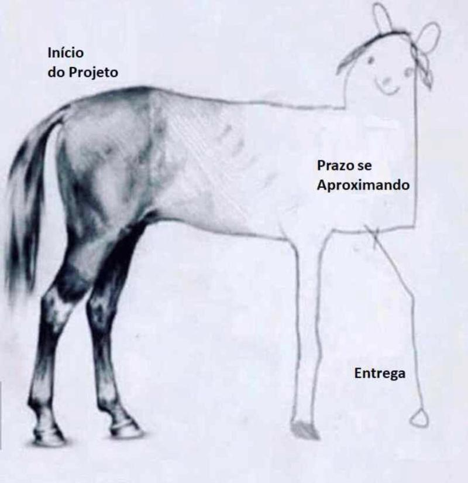

Alguns pontos a respeito do Trabalho de Conclusão de Curso - TCC.

## Enfoque
Inicialmente é preciso entender que um trabalho de conclusão de curso procura:
 - Enfatizar por meio de um trabalho formal, um conjunto de disciplinas e seu **aprendizado adquirido na Universidade**, além de sua capacidade de conexão com novos conhecimentos. 
 - Demonstrar domínio deste conteúdo a ser submetido a avaliadores. 
 - Conhecer o modelo de pesquisa e suas características científicas (apresentação temática, revisão bibliográfica, metodologia, etc). 
 - Dominar a escrita formal e sua expressão verbal na apresentação. 

### Tipos

A partir destas referências, devemos entender também a diferença entre [pesquisas](https://pt.wikipedia.org/wiki/Stricto_sensu):

 1. Latu sensu - Ampla (TCCs, pós-graduações) 
 2. Scricto sensu - Estrita, específica (mestrado, doutorado) 

De modo que o TCC posiciona-se em um tipo de pesquisa que pode ser considerada "ampla" no sentido de abordar conteúdos correlatos, não exigindo que o pesquisador se dedique a um ponto específico a fim de exaurir determinado enfoque. 
Exemplifica-se: um projeto de TCC pode propor: "A construção de um sistema para avaliação do nível de leitura dos discentes nas universidades". Isso indica que o pesquisador(a) vai precisar consultar diversos elementos teóricos para o desenvolvimento do documento, a exemplo de i) linguagem de programação web, ii) banco de dados, iii) estudo de interface homem x computador, iv) hospedagem do site (deploy), etc... E ainda decidir se há viabilidade para a construção (ou não) de um protótipo que possa exemplicar sua pesquisa. 

Diferente de um trabalho stricto sensu, no TCC o aluno(a) tem muito mais **autonomia** para direcionar o tema. Visto que na grande maioria dos trabalhos de mestrado e doutorado, o aluno(a) segue uma linha de pesquisa de interesse do orientador. Nas pesquisas de conclusão de curso deve haver uma sintonia temática, onde o professor(a) domina determinada área do conhecimento e geralmente proporciona um nível de escolha muito maior ao discente na definição do tópico de pesquisa. 

### Formas de escrita

- **Artigo** - Neste formato, o trabalho é escrito de forma que poderá ser **publicado** em algum periódico da área.
- Modelo tradicional - Neste formato o trabalho é estruturado em grupos bem definidos, no formato acadêmico tradicional denominado de monografia para publicações que atendam a formalidade institucional.

Em ambos os formatos, os tópicos estruturais devem estar presentes (introdução, referencial teórico, justificativa, problema, etc...) porém de formas diferentes devido ao foco de apresentação final do texto.  

**Atualização**: O ICT em 2024 definiu um conjunto de [diretrizes](https://drive.google.com/drive/u/2/folders/1VfN8TzlI3XujEwv05J7SNSKbpL8PMR_J) para o TCC. Nesta diretriz, o TCC 1 por exemplo, deve continuar no formato tradicional (tipo monografia) e no TCC 2 pode-se escolher entre continuar com o formato monografia ou mudar para artigo. Pode-se ainda concluir o TCC todo no formato de monografia e extrair um artigo para publicação posterior.

**Atenção**: As diretrizes do ICT permitem em seu documento no artigo 17: Que poderá ser substituída a banca avaliadora do TCC caso o discente produza um artigo com seu orientador e que o mesmo seja publicado em periódicos com determinado grau de avaliação, recebendo a nota máxima do programa. Leia a diretriz para maiores detalhes. 

#### Acordo para publicação futura

Como a instituição estabeleceu uma norma que prevê a escrita em formato de monografia com template definido, sempre **convido** o orientando a um acordo inicial para transformarmos a monografia em um artigo no final do processo do TCC. Objetivando a publicação do trabalho em jornais, congressos ou outras formas de comunicação. Essa prática é vantajosa para ambas as partes e acrescenta importante marco no currículo. E ainda, o orientador também é nomeado no artigo com o(a) discente (primeiro autor(a)), é constrangedor ter que lembrar isso visto que além de uma norma, seria um gesto de consideração à orientação.

### Áreas 

Em particular, minhas áreas de conhecimento estão relacionadas a: 

 - Desenvolvimento web (front e back end) 
 - Desenvolvimento mobile 
 - Linguagens de programação 
 - Recuperação da informação (indexação, classificação, artefatos de representação do conhecimento) 
 - Ontologias (representação do conhecimento)

### Observações 

Outro detalhe importante é que em uma orientação, deve haver uma confiança mútua entre orientando e orientador. Discentes que já possuem determinado projeto e, digamos, uma auto confiança tal que o impeça de ouvir as orientações, não cria um ambiente saudável. É preferível evitar este tipo de situação, com a liberdade de procurar outro orientador. 
Ter compromisso, atenção aos prazos e entregas, boa comunicação (com educação) evitando atrasos nas respostas e disposição à pesquisa, são ingredientes que contribuem para um bom trabalho. 

É preciso também uma pesquisa prévia do perfil da orientação, sua área de atuação, suas convicções, seu modo de trabalho. Visto que o desenvolvimento de um trabalho em equipe requer parceria, foco e concordância mútua. 

Gostaria ainda de fazer uma colocação de forma bem clara: se o(a) discente já aborda o TCC como um "peso", um "fardo" que precisa ser feito apenas para cumprir uma obrigação acadêmica, realmente é melhor evitar a minha orientação. Minha experiência é infeliz com este tipo de perfil, porque a pessoa dedica apenas o "resto" de tempo para o TCC. Ouvir coisas do tipo: "não mexi no TCC porque tive uma reunião importante no trabalho" - então o TCC não é importante?! Ou ainda na reunião semanal: "ok professor, vamos reunir rapidinho..." - rápido porque? há coisas mais importantes e a reunião de orientação (agendada) atrapalha? Definitivamente não é o perfil de pessoa que desejo orientar. Na verdade, os alunos que já trabalham têm apresentado um perfil mais desafiador na orientação e desenvolvimento do TCC.

Importante também ressaltar que o TCC é um trabalho sério como uma dissertação ou tese e *precisa* de investimento em pesquisa ampla e confiável. De modo que a prática da escrita precisa ser exercitada. É preciso desenvolver os tópicos procurando reunir o máximo de informação relevante sobre o tema, ainda que esteja no formato de artigo. Aliás, o fato de produzir um trabalho no formato de artigo **não** quer dizer que optou-se por um "resumo" ou um formato mais "fácil" para cumprir com a obrigação acadêmica. *2024*: a regra mudou para a escrita do TCC na Universidade e deve-se iniciar o trabalho em formato de monografia, vide os templates disponibilizados pela direção do instituto.

#### O trabalho não é SÓ seu 

Uma atualização necessária para evitar constrangimentos: é preciso ter o entendimento que o trabalho acadêmico mesmo sendo escrito pelo(a) discente, tem também como co-autoria o(a) orientador(a). Na verdade é até constrangedor ter que explicar isso nesta época, visto que pessoas da minha geração têm por grande estima ter seus nomes ao lado de seus professores. Portanto, ao elencar o nome no documento, o(a) orientador(a) também participa do trabalho. O mesmo raciocínio é válido para comunicações a respeito do trabalho. Se há um questionário a ser enviado por causa da pesquisa ou outras menções, no texto deve constar referência do discente e a referência ao orientador. É uma questão de respeito, bom senso, gratidão, enfim... são valores que trago comigo das minhas orientações passadas e que agora nesta geração, de forma surpreendente, preciso tornar isso explícito. 

Se você não entende desta forma, está tudo bem e é seu total direito pensar diferente. Neste caso, procure outra pessoa para orientação, pelamor! 

#### A realidade da IA no dia a dia 

Resista à IA moderna no sentido de "apoio na redação". Por mais "prático" que possa ser solicitar um texto a um Chat qualquer, o *exercício da escrita* é um **processo de crescimento intelectual** e exatamente neste processo, reside o objetivo de um trabalho acadêmico. É no processo de leitura, de descoberta, de perguntas, que a escrita e a maturidade surge. **Use a IA para corrigir textos próprios, sugerir autores ou trabalhos, etc... mas solicitar um "texto generativo" para incluir no trabalho é algo que não pode ser aceito.**





"Escrever é uma habilidade que você pode desenvolver por meio do exercício do estudo, da leitura, do aprendizado de técnicas específicas. 



### Fluxo de trabalho

É comum que em um primeiro momento exista a ansiedade de procurar um modelo (template) e já começar a estruturar / escrever algo. Mas é importante definir de forma muito clara, o tema, objetivos, problema e estratégia de pesquisa. Em uma sequência inicial, pode-se considerar: 

 1. Ter um ou mais temas como referências. 
 2. Convidar um professor(a) orientador(a) que tenha conhecimento / interesse no tema. 
 3. Alinhar com o orientador(a) um tópico específico deste tema, baseado nas referências iniciais. 
 4. Realizar uma **pesquisa prévia**, eficiente, se há algum material (artigo, dissertação, tese) igual ou próximo da temática a ser desenvolvida. **[Muito importante]**
 5. Definir uma estrutura de trabalho (template de artigo TCC) compartilhada (Drive, Notion, LaTex {Overleaf}).
 6. Definir uma agenda de encontros periódicos com entregas alinhadas ao cronograma da universidade. 

### Boas práticas  

Ao iniciar a orientação, de acordo com a disponibilidade de cada um, é importante definir E seguir um *agendamento*, seja semanal ou quinzenal. 
- Caso não possa comparecer às reuniões é importante avisar ANTES. (Aliás, isso independente do âmbito acadêmico, qualquer compromisso precisa de respeito.)  
- Em situações que precisam de algum nível de decisão (principalmente na dinâmica da orientação), na condição de discente, é importante consultar o orientador e não simplesmente levar "definições" para a orientação. 
- Ao receber um material (pdf, comentário, email) envie um retorno por mais simples que seja, isso retira qualquer dúvida sobre uma entrega que vai influenciar na próxima reunião. 
- Ao receber um email da orientação, tente responder o mais breve possível. De igual a forma, a orientação deve agir com o mesmo princípio. 
- Avalie sua capacidade de falar em público. Sua defesa mesmo em ambiente online vai demandar um mínimo de desenvoltura e capacidade de expressão. E falar em público não é um "dom" que somente alguns têm, é um treinamento que pode e deve ser desenvolvido. Reflita sobre esse tema com uma entrevista do Eslen: ["Medo de falar em público"](https://www.youtube.com/embed/cnPPPptCD8w?start=133)

<h3 id="softapoio">Softwares de apoio <a href="https://www.erfelipe.com.br/tcc/#softapoio" target="_blank"> #</a></h3>

Vou sempre atualizar esta lista, visto que a dinâmica tecnológica permite a criação de novas ferramentas de forma cada vez mais rápida. Inicialmente tenho usado alguns softwares que são realmente úteis na criação / organização da informação: 
<h4> Gestão de tarefas </h4>
 - [Trello](https://trello.com) Um ótimo aplicativo para gestão de tarefas baseado em Kanban.
<h4> Anotações </h4>
 - [Obsidian](https://obsidian.md) Um app do tipo "super bloco de notas" com ferramentas de busca e visualização interessantes. Idéias, links, sites... anote tudo que for importante para o trabalho com este gerenciador de notas. 
 - [Evernote](https://evernote.com/intl/pt-br) Possui plug-in para o Browser e versão app. Idéias, links, sites... anote tudo que for importante para o trabalho com este gerenciador de notas. 
 - [Notion](https://www.notion.so/product?fredir=1) De tudo um pouco, permite compartilhar notas, trabalhos (textos) e mais. 
<h4> Gestão bibliográfica </h4>
 - [Zotero](https://www.zotero.org) Controle suas referências bibliográficas (artigos, livros) no padrão ABNT. 
 - [Mendeley](https://www.mendeley.com) Controle suas referências bibliográficas 
<h4> Fluxogramas, esquemas gráficos </h4>
 - [Draw.io](https://app.diagrams.net) e [Draw.io-app](https://github.com/jgraph/drawio) Construa mapas mentais, fluxogramas, esquemas gráficos. 
 - [eraser](https://app.eraser.io) fluxogramas, esquemas gráficos, com opção de divulgação online. 
 - [Pencil](https://pencil.evolus.vn) Construa mapas mentais, fluxogramas, esquemas gráficos.  
 - [Cmap](https://cmap.ihmc.us/) Mapas conceituais de modo fácil e intuitivo. 
 - [Excalidraw](https://excalidraw.com) fluxogramas, esquemas gráficos.
 - [Sketch](https://www.sketch.com) Prototipação, criação de interfaces e imagens. (opção de uso livre para contas acadêmicas). 
 - [Whimsical](https://whimsical.com/) Mapas mentais, fluxogramas e estruturas de informação gráficas interessantes. 
 - [GitMind](https://gitmind.com/) Mapas mentais, fluxogramas e estruturas de informação gráficas interessantes. 
 - [Lucid](https://www.lucidchart.com/pages/) Cronogramas e esquemas gráficos (opção de conta gratuíta).
 - [Mermaidchart](https://www.mermaidchart.com) Mapas mentais e fluxogramas. Pode ser programado com script. 
<h4> Prototipação, UX, Mockup </h4>
 - [Figma](https://www.figma.com) Prototipação, criação de interfaces e imagens. (opção de plano simples grátis). 
 - [Maze](https://maze.co) Em conjunto com o Figma permite criar cenários de análise com relatórios comportamentais. 
 - [Balsamiq](https://balsamiq.com) Ótimo ambiente para prototipação com muitos componentes prontos. Versão gratuita para estudantes.
 - [Sketch](https://www.sketch.com) Grande concorrente do Figma. Versão gratuita para estudantes.
<h4> DER </h4>
 - [Astah](https://astah.net/support/astah-pro/user-guide/er-diagram/) Diversos diagramas (incluindo DER) versão gratuita acadêmica. 
 - [Vertabelo](https://vertabelo.com) DER - Diagrama de entidade e relacionamento (online versão free - acadêmica)
<h4> UML </h4>
 - [Astah](https://astah.net/support/astah-pro/user-guide/er-diagram/) Diversos diagramas (incluindo UML) versão gratuita acadêmica. 
<h4> Editor de texto </h4>
 - [Scrivener](https://www.literatureandlatte.com/scrivener/overview) Editor de texto não linear (pago). Comprei, gosto, mas reconheço que para o perfil discente, outros editores gratuitos podem resolver. Mas a sugestão é conhecer o programa e quem sabe usá-lo futuramente. 
<h4> Cronogramas </h4>
 - [GanttProject](https://www.ganttproject.biz) Cronogramas (gráfico de Gantt).
 - [Zoho](https://www.zoho.com/pt-br/projects/) Cronogramas (gráfico de Gantt). 
<h4> Repositório de arquivos </h4>
 - Google Drive para o compartilhamento de documentos.  
 - [DropBox](https://www.dropbox.com) Drive de arquivos
 - [GitHub](https://github.com) Repositório e versionador de arquivos 
 - [BitBucket](https://bitbucket.org) Repositório e versionador de arquivos 
<h4> Mobile </h4>
 - [Adalo](https://pt-br.adalo.com) Desenvolvimento gráfico 

### Desafio

Assim como em diversos projetos, seja um curso, um trabalho, etc... começamos com entusiasmo e certo foco. No decorrer do caminho, o cansaço e outras situações (saúde, outros compromissos) competem e colocam em risco o planejamento inicial.
Para não terminar como o desenho da eguinha, um princípio importante a ser seguido é estabelecer uma agenda de ações semanais. Defina em seu agenda dias e horários onde você deve estar comprometido com o projeto, ainda que possam surgir exceções, essa organização é muito útil para forçar atitudes que contribuam com o bom andamento da pesquisa.   

### O pulo do gato 

 
Tenho convicção que nossa vida consiste em um conjunto de dimensões que precisam estar em equilíbrio para alcançarmos êxito naquilo que temos como objetivo. Cuidar da saúde com uma visão ampla: Prática de esportes; alimentação saudável; hidratação (muita água); dormir bem (forma adequada), são maneiras de respeitar seu corpo e proporcionar um melhor raciocínio. Cuide da sua mente, tenha um [Mindset](https://www.amazon.com.br/Mindset-Carol-S-Dweck/dp/8547000240) focado em coisas boas, cultive otimismo, entenda a lei do retorno (o que você planta, você colhe) e evite as [redes sociais](https://www.erfelipe.com.br/social-media/). Há também a dimensão espiritual: manter a fé em Deus e saber que nossa vida não termina neste mundo, mas que nossas ações definem uma condição futura, eterna. 
Procure o equilíbrio e por mais difícil que seja, não altere a sequência natural da vida. Haverá mais tempo para "aproveitar" no futuro, se você plantar (viver) o agora com esforço e dedicação. 
> Tudo tem a sua ocasião própria, e todo propósito debaixo do céu tem o seu tempo. - [Eclesiastes 3](https://www.bibliaonline.com.br/acf/ec/3)

## Diretrizes no Instituto de Ciências Tecnológicas - ICT 

<strong>Muito importante</strong> ler com atenção as diretrizes para Realização do Trabalho de Conclusão de Curso: [link da norma](https://drive.google.com/drive/u/2/folders/1VfN8TzlI3XujEwv05J7SNSKbpL8PMR_J)

<h2 id="materialApoio"> Material de apoio e referências metodológicas <a href="https://www.erfelipe.com.br/tcc/#materialApoio"># </a> </h2>

<b>Fundamental</b> acessar este drive e conhecer os arquivos disponíveis:
<ul> 
  <li> <a href="https://github.com/erfelipe/Orientacoes-TCC" target="_blank">https://github.com/erfelipe/Orientacoes-TCC</a> </li>
</ul>

### Direcionamentos - Estrutura de um TCC

<h4>TCC 1 deve-se desenvolver:</h4>
<ul>
  <li>Título e subtítulo (se houver)</li>
  <li>Resumo ou sinopse e abstract (apresentação concisa e seletiva do trabalho)</li>
  <li>Introdução</li>
  <ul><li>Problema</li></ul>
  <ul><li>Justificativa</li></ul>
  <li>Objetivos</li>
  <ul><li>Objetivo geral</li></ul>
  <ul><li>Objetivo específico</li></ul>
  <li>Referencial teórico (referências bibliográficas)</li>
  <li>Metodologia (planejamento)</li>
  <li>Resultados Esperados</li>
  <li>Cronograma</li>
</ul>

<h4>TCC 2 (contemplado o TCC 1) deve-se adicionar:</h4>
<ul>
  <li>Metodologia</li>
  <ul><li>Desenvolvimento</li></ul>
  <li>Resultados / Discussão</li>
  <li>Conclusão</li>
</ul>

<h2>Introdução </h2> 

É o local onde o tema principal do trabalho é exibido pela primeira vez, geralmente em uma dimensão maior para o mais específico. Procura-se despertar ao leitor interesse pelo trabalho, a fim de que continue a leitura. Neste momento também é introduzido o tópico norteador do trabalho: o problema a ser resolvido em forma de pergunta. Essa frase questionadora deve ter um foco mais amplo possível, dentro dos princípios da Design Science Research (DSR) sempre que aplicável.

Tenho o costume de explicar que uma boa introdução inicia em uma abordagem "top down", onde o ambiente, o cenário maior onde o problema se situa, é apresentado. E dentro deste ambiente, detalha-se um cenário mais específico, onde o trabalho se situa. 

<ul>
  <li>Segundo Alves (2003), a introdução deve ainda:</li>
  <ul><li>Definir o assunto / tema tratado;</li></ul>
  <ul><li>Situar o assunto em relação ao tempo, à relevância do problema, à contribuição que tal assunto traz para a sociedade e para o ser humano;</li></ul>
  <ul><li>Situar o assunto no espaço geográfico;</li></ul>
  <ul><li>Estabelecer os objetivos do trabalho e as <b>questões</b> de estudo levantadas;</li></ul>
  <ul><li>Apresentar a metodologia de busca da solução do <b>problema</b>;</li></ul>
  <ul><li>Apresentar como está organizado o texto.</li></ul>
</ul>

<h3>Problema</h3>

O problema geralmente é formulado como um questionamento. <i>Uma pergunta</i> que o trabalho como um todo procura responder. É um ponto central embora esteja "dentro" de um tópico maior (introdução). É baseado neste questionamento que todo o trabalho deve ser redigido, portanto, deve ser a pensado como definição inicial, antes mesmo da redação da introdução, pois todos os elementos do trabalho deverão trabalhar para responder a este problema.   A pergunta problema é escrita no final da introdução. 

<h3>Justificativa</h3>

É uma seção após a introdução que permite ao leitor entender que vale a pena investir nesta pesquisa para solucionar o problema apresentado. Pode-se apresentar características de outros problemas decorrentes do problema a ser solucionado, bem como vantagens na solução para o problema apresentado. 

<h3>Objetivos</h3>

<ul>
  <li>Objetivo geral</li>
  <ul><li>O <b>objetivo geral</b> é a descrição do que se pretende alcançar de forma a responder o problema. Descreve a ideia geral, de forma sucinta e direta, a solução do problema. Não deve-se explicar ou justificar a solução neste momento, apenas apresentá-la. </li></ul>
  <li>Objetivos específicos</li>
  <ul><li>Nos <b>objetivos específicos</b> descreve-se o que é necessário fazer para alcançar o objetivo geral, geralmente em formato de tópico. <a href="https://projetoacademico.com.br/objetivos-especificos-tcc/">https://projetoacademico.com.br/objetivos-especificos-tcc/ </a> </li> </ul>
</ul>

<h2 id="refTeorico">Referencial teórico </h2>

<a href="https://www.erfelipe.com.br/tcc/#refTeorico">#</a> <i>No referencial teórico, procura-se autores e trabalhos já realizados, que possam ajudar a resolver o problema. Ou seja, quais conhecimentos e técnicas o leitor precisa conhecer para que consiga entender a metodologia a ser apresentada (ou os passos que serão seguidos para resolver o problema).</i>

<h3>Como abordar o referencial teórico?</h3> 

<ul>
  <li>Pense no referencial teórico como uma “infra estrutura teórica” para entender seu projeto. Ou ainda: o que seu leitor precisa saber ANTES de ler a metodologia do projeto?</li>
  <li>De forma hipotética: se seu trabalho vai responder um problema propondo uma solução em forma de software, quais as características deste software?</li>
  <ul><li>Modelo web (ou mobile)</li></ul>
  <ul><li>Acesso a banco de dados?</li></ul>
  <ul><li>API? Etc...</li></ul>
</ul>

<ul>
  <li>Neste caso, o referencial teórico deve ter subtópicos como:</li>
  <ul><li>Internet</li></ul>
  <ul><li>Interface homem máquina</li></ul>
  <ul><li>Modelo entidade relacionamento</li></ul>
  <ul><li>Linguagem SQL</li></ul>
  <ul><li>Etc...</li></ul>
</ul>

E dos tópicos selecionados para seu trabalho, quais autores você leu para aprender sobre eles? Livros? Artigos? Sites especializados? E não apenas "para você", mas principalmente para que o leitor conheça estes tópicos a partir de autores "de sua confiança". Por isso a preferência por autores clássicos. 

Ou seja, quando o trabalho for descrever como o software foi feito, o texto vai citar elementos destas áreas de conhecimento e seu leitor já passou por elas a ponto de compreender o processo da construção (metodologia).

<h3>Onde encontrar boas referências?</h3>
<h4 style="background-color: #fafafa">As orientações deste tópico em específico receberam a relevante contribuição do professor Dr. <a href="http://lattes.cnpq.br/4343678779982973" target="_blank"> Rodrigo Braga</a>. </h4>

<h4>Treinamentos (opcional) </h4>
<ul>
  <li>Visite o calendário da Capes e procure pelos treinamentos de nossa área: Ciências Exatas e da Terra:</li>
  <ul><li><a href="https://www.periodicos.capes.gov.br/index.php/treinamentos/calendario.html" target="_blank">http://www-periodicos-capes-gov- br.ezl.periodicos.capes.gov.br/index.php/treinamentos/calendário.html</a> </li></ul>
  <li>Participe de pelo menos um treinamento para aprender sobre as melhores práticas na utilização do site e suas possibilidades de pesquisa.</li>
</ul>

<h4>Documente o processo de pesquisa (revisão sistemática se possível ou se necesssária)</h4>

Pode-se elencar os seguintes elementos para uma revisão mais consistente e estruturada: 

<ul>
  <li>Definir pergunta norteadora</li>
  <li>Definir descritores</li>
  <li>Definir estratégia de busca e bases de dados</li>
  <li>Definir limites e critérios de exclusão/inclusão</li>
  <li>Realizar pesquisas nas bases de dados</li>
  <li>Exportar os dados para um gerenciador de referências (zotero ou mendeley)</li>
  <li>Analisar os resultados</li>
  <li>Fazer um quadro / fluxograma com os trabalhos selecionados</li>
  <li>Discutir os resultados dos artigos ou criar um quadro com os principais achados</li>
</ul>

E ainda:

<ul>
  <li>No referencial teórico é importante registrar COMO as referências foram encontradas.</li>
  <ul><li>Ao realizar uma pesquisa, registre qual site foi usado, em qual momento (set/2022) e quais os termos pesquisados. Exemplo: “Em set/2022 foi pesquisado no site xyz.com.br a string “alfabetização infantil”. Desta pesquisa foram selecionados 10 artigos, sendo que 4 foram selecionados para contribuir neste trabalho e 6 foram descartados em uma leitura mais cuidadosa”.</li></ul>
  <ul><li>Este parágrafo explicativo é uma “introdução” ao tópico referencial teórico, e deve ser claro e breve, seguindo com os tópicos das referências que devem ser exploradas.</li></ul> 
  <li>O objetivo é mostrar à banca que o material selecionado para o referencial não “brotou do nada”. Houve um método, um caminho seguido que pode, inclusive, ser repetido por outros pesquisadores para conseguir estes resultados.</li>
</ul>

<h4>Onde encontrar boas referências? (artigos)</h4> 

<ul>
  <li>Capes</li>
  <ul><li>Verifique que quando você acessando o site, o tipo e acesso vai variar de forma geografia. Se estiver dentro da Unifei, o site deve reconhecer o IP e liberar acesso institucional. Se estiver fora da Unifei, tente logar como <b>Acesso CAFe</b>.</li></ul>
  <ul><li><a href="https://www.periodicos.capes.gov.br" target="_blank">https://www.periodicos.capes.gov.br</a> </li></ul>
  <li>Google acadêmico</li>
  <ul><li><a href="https://scholar.google.com.br/?hl=pt" target="_blank">https://scholar.google.com.br/?hl=pt</a> </li></ul>
  <li>BDTD</li>
  <ul><li><a href="https://bdtd.ibict.br/vufind/" target="_blank">https://bdtd.ibict.br/vufind/</a> </li></ul>
  <li>Dicas</li>
  <ul><li><a href="https://youtu.be/U68BO0qSZIo" target="_blank">https://youtu.be/U68BO0qSZIo</a> </li></ul>
  <ul><li><a href="https://youtu.be/j22AF38hiAI" target="_blank">https://youtu.be/j22AF38hiAI</a> </li></ul>
    <li>É muito comum ao visitar as bibliotecas digitais de artigos, identificar artigos interessantes porém, pagos. Uma forma de viabilizar a leitura destes trabalhos é o serviço <a href="https://sci-hub.st" target="_blank">https://sci-hub.st</a> Basicamente deve-se localizar o código identificador do artigo (DOI, ISBN), ou na impossibilidade destes códigos, a URL do mesmo. Visite o sci-hub e use o sistema de busca. Na grande maioria das vezes os artigos são localizados em seu formato completo. </li>
</ul>

Assista o vídeo do Prof. Rodrigo Braga: 



<h4 id="comoLer">Como “ler” o material encontrado</h4>

<ul>
  <li>É comum no processo de pesquisa, encontrar um grande número de artigos e livros que possuem potencial de contribuição com o trabalho. Porém, não é possível ler todo o conteúdo a tempo de redigir o TCC. Deste modo, é indicado a utilização de técnicas para identificar e resumir o conteúdo dos materiais encontrados.</li>
  <ul><li>Faça uma leitura “dinâmica” inicialmente, procurando os trechos do trabalho que possam exprimir o teor do trabalho lido (resumo, introdução, conclusão).</li></ul>
  <ul><ul><li>Caso o trabalho tenha potencial de contribuição, selecione-o (marque-o) e faça uma segunda leitura mais detalhada, marcando trechos (sublinhar, destacar). </li></ul></ul>
  <ul><li>Tente resumir o texto com suas palavras.</li></ul>
  <ul><li>Use um gerenciador de arquivos e citações, a exemplo do software <a href="https://www.zotero.org" target="_blank">https://www.zotero.org</a> para não perder este trabalho de pesquisa referencial.</li></ul>
  <ul><li>Há muitas 'técnicas' de estudo / leitura, mas não há uma bala de prata, uma regra universal. O segredo é conhecer a si mesmo e perseverar em um método, um modelo que lhe traga produtividade. Reflita: <a href="https://youtu.be/xtcsnqe_xGA" target="_blank">https://youtu.be/xtcsnqe_xGA</a> </li></ul>
</ul>

<h2>Importante</h2>

Assista este vídeo para conhecer o método de leitura dinâmica e pontual a fim de facilitar a seleção de artigos e posteriormente, sua compreensão: 


<h4 id="aPartir">IMPORTANTE: Como encontrar outros trabalhos e autores a partir de um bom artigo?  </h4>

Essa dica é muito importante e pode poupar um tempo precioso do pesquisador. São dois projetos (softwares) capazes de identificar referências e procurar por trabalhos e autores próximos (àquela referência): 

<ul>
  <li> <a href="https://www.researchrabbit.ai" target="_blank">https://www.researchrabbit.ai</a> </li>
  <li> <a href="https://www.vosviewer.com" target="_blank">https://www.vosviewer.com </a> </li>
</ul>

<h2>Referências na ABNT</h2>

<i>Os trabalhos referenciados (artigos, livros) devem ser documentados no formato da Associação Brasileira de Normas Técnicas</i>

<h3>Como colocar as referências no formato ABNT?</h3>

<ul>
  <li>Consulte um profissional da área, um bibliotecário.</li>
  <li>Use softwares para este trabalho:</li>
  <ul><li>Zotero - <a href="https://www.zotero.org/" target="_blank">https://www.zotero.org/</a></li></ul>
  <ul><li>Mendeley - <a href="https://www.mendeley.com/" target="_blank">https://www.mendeley.com/</a></li></ul>
  <li>Dicas</li>
  <ul><li><a href="https://youtu.be/H3K3K74r_Vo" target="_blank">https://youtu.be/H3K3K74r_Vo</a></li></ul>
  <ul><li><a href="https://youtu.be/g4Uq1E_NvMk" target="_blank">https://youtu.be/g4Uq1E_NvMk</a></li></ul>
  <ul><li><a href="https://youtu.be/hCOz_3h-nrU" target="_blank">https://youtu.be/hCOz_3h-nrU</a> (se conseguir tolerar o sotaque...)</li></ul>
</ul>

<h2>Metodologia</h2>#

<i>Etapa que deve descrever os passos necessários à solução do problema.</i>

<h3>Definição</h3>

<ul>
  <li>Segundo o dicionário:</li>
  <ul><li>metodologia s. f.</li></ul>
  <ul><li>1 lógica ramo da lógica que se ocupa dos métodos das diferentes ciências</li></ul>
  <ul><ul><li>1.1 parte de uma ciência que estuda os métodos aos quais ela própria recorre </li></ul> </ul>
  <ul><ul><li>1.2 literatura em literatura, investigação e estudo, segundo métodos específicos, dos componentes e do caráter subjetivo de uma narrativa, de um poema ou de um texto dramático </li></ul> </ul>
  <ul><li>2 corpo de regras e diligências estabelecidas para realizar uma pesquisa; método</li></ul>
  
  <li>Consulte também:</li>
  <ul><li><a href="https://pt.wikipedia.org/wiki/Metodologia" target="_blank">https://pt.wikipedia.org/wiki/Metodologia</a></li></ul>
  <ul><li>Podemos dizer que metodologia é a explicação detalhada e exata de toda ação desenvolvida no (caminho) do trabalho de pesquisa. É a explicação do tipo de pesquisa, dos instrumentos utilizados (questionário, entrevista etc), do tempo previsto, da equipe de pesquisadores e da divisão do trabalho, das formas de tabulação e tratamento dos dados, enfim, de tudo aquilo que se utilizou no trabalho de pesquisa.</li></ul>

  <li>Segundo Alves:</li>
  <ul><li>A metodologia deve ser apresentada de forma descritiva. </li></ul> 
  <ul><li>Tem a finalidade de expor e demonstrar logicamente o objeto de estudo. </li></ul> 
  <ul><li>Deve haver um encadeamento lógico nas proposições. </li></ul> 
  <ul><li>No processo de construção de ideias, evite usar generalizações, tais como: “Todos sabem que...”, “geralmente...”, “segundo alguns autores...” (quais?!). </li></ul> 
  <ul><li>Evite construir frases muito longas, usar palavras supérfluas, pedantismos, gírias na argumentação e, ainda, aumentativos e diminutivos, ou mesmo superlativos, o que prejudica o estilo. </li></ul> 

  <li>Na metodologia descreve-se o desenvolvimento do trabalho, seja um estudo de caso, seja o desenvolvimento de protótipo, etc... </li>
  <li>Neste momento pode-se citar tecnologias específicas, modelos técnicos e demais artefatos que fazem parte do trabalho. </li>
  <ul><li>Visto que o leitor já se inteirou das tecnológicas e teorias necessárias ao entendimento do projeto no referencial bibliográfico. </li></ul>
  <li>É importante citar as dificuldades também, bem como modelos que foram alterados durante a pesquisa. </li>
  <ul><li>É muito comum “filtrar” a descrição demonstrando apenas um “caminho ideal”, mas o trabalho é valorizado quando percebe-se que no processo de pesquisa, rumos foram corrigidos e dificuldades foram resolvidas. </li></ul>
  <li>Pode-se fazer uso de mapas mentais, fluxo de processos e diagramas para ilustrar o processo metodológico. </li>
</ul>

<h3>Como realizar, em geral, uma boa avaliação dos resultados: </h3>

<ul>
  <li>Encontre 2 ou 3 artigos similares ao seu (mesmo assunto) que você gostou. </li>
  <li>Veja como a seção de resultados é apresentada e use uma estrutura similar. </li>
  <li>Veja qual a sequência que o artigo segue para avaliar os resultados. </li>
  <li>Construa imagens, tabelas e métricas a fim de tornar seu trabalho comparável. </li>
</ul>

<h2>Resultados e Discussão</h2>

Consulte: <a href="https://blog.fastformat.co/resultado-e-discussao/" target="_blank">https://blog.fastformat.co/resultado-e-discussao/ </a>

<h2>Conclusão</h2>

<i>Fechamento do trabalho</i>

<ul>
  <li>A conclusão é um fechamento que descreve se o objetivo foi atingido de forma completa, parcial ou se não houve como solucionar o problema. Muitas pessoas acham que o sucesso do trabalho está em uma conclusão que indique a solução plena do problema, mas não é assim. Indicar as dificuldades e reconhecer que parte do objetivo foi alcançado, é muitas vezes, o esperado de trabalhos acadêmicos. </li>
</ul>

<ul>
  <li>Segundo Alves: </li>
  <ul><li>Constitui a fase final do processo de elaboração do texto científico, que teve início na Introdução. </li></ul> 
  <ul><li>É o clímax do trabalho. </li></ul> 
  <ul><li>Deve ter elementos estruturais para que esta culminância se efetive. </li></ul> 
  <ul><li>É o momento da recapitulação das conclusões a que o autor chegou em cada parte do desenvolvimento. </li></ul> 
  <ul><li>Deve conter a análise das inferências, conclusões a que o estudante chegou ao logo de sua busca. </li></ul> 
  <ul><li>A comunicação dos resultados é fundamental. </li></ul> 
  <li>É fundamental que os dados contidos na Conclusão estejam em relação direta com os objetivos perseguidos e com as questões levantadas. Não deve conter nenhum elemento novo, não discutido no corpo do trabalho. </li>
</ul>

<h2>Templates</h2>

<i>Modelos para redação do trabalho</i>

<ul>
  <li>Para artigos, recomendo dois templates:  </li>
  <ul><li>Sociedade Brasileira de Computação - <a href="https://www.sbc.org.br/documentos-da-sbc/category/169-templates-para-artigos-e-capitulos-de-livros" target="_blank">https://www.sbc.org.br/documentos-da-sbc/category/169-templates-para-artigos-e-capitulos-de-livros</a> </li></ul> 
  <ul><li>IEEE - <a href="https://www.ieee.org/conferences/publishing/templates.html" target="_blank">https://www.ieee.org/conferences/publishing/templates.html</a> </li></ul> 
</ul>

<h3>Como verificar seu texto no overleaf</h3>

<ul>
  <li>Use a ferramenta <a href="https://languagetool.org/onboarding" target="_blank">https://languagetool.org/onboarding</a> </li>
</ul>

<h2>Cronograma</h2>

<ul>
  <li>O cronograma é uma organização gráfica das informações sobre tarefas / mês, que facilita a compreensão do leitor sobre as principais fases de seu trabalho, bem como da sequência lógica a ser seguida. </li>
  <li>Essa informação também ajuda a avaliação do projeto a verificar a probabilidade (ou não) da execução do projeto. </li>
  <li>Devem estar listadas as principais atividades do trabalho na primeira coluna. </li>
  <li>Os meses devem figurar nas demais colunas. </li>
  <li>Marca-se a atividade em seu(s) respectivo(s) mês(es). </li>
  <li>Pode ser feito de forma simples 🫥: </li>
  <ul><li>Uma tabela no próprio editor de texto </li></ul>
  <ul><li>Como planilha eletrônica (excel, etc...) </li></ul>
  <li>Ou melhor apresentável:  </li>
  <ul><li><a href="https://www.lucidchart.com/pages/" target="_blank">https://www.lucidchart.com/pages/</a> </li></ul>
  <ul><li><a href="https://www.ganttproject.biz" target="_blank">https://www.ganttproject.biz</a> </li></ul>
  <ul><li><a href="https://www.zoho.com/pt-br/projects/" target="_blank">https://www.zoho.com/pt-br/projects/</a> </li></ul>
</ul>

<h2 id="valideTrabalho">Valide seu trabalho para evitar textos que remetam a plágio <a href="https://www.erfelipe.com.br/tcc/#valideTrabalho" target="_blank"> #</a> </h2>

Use a ferramenta parceira da Unifei em: <a href="https://unifei.edu.br/prppg/integrigade-da-pesquisa-turnitin/" target="_blank">Turnitin </a> 

O plágio é a pior situação que um trabalho pode ser rotulado. Além de se configurar como deficiência de caráter, de forma desonesta de produção intelectual, é extremamente vexatório para os autores essa conduta. 

Mas pode ocorrer o fato de que em nosso idioma, diversas frases e construções textuais sejam comuns. Isso não configura plágio, mas uma sequência de significativa de coincidências que devem ser evitadas. 

<h2 id="comportarBanca">Como se comportar durante uma banca: <a href="https://www.erfelipe.com.br/tcc/#comportarBanca" target="_blank"> #</a></h2>

<i>Do ponto de vista do candidato, o desejável é que a banca seja rápida e sem nenhuma surpresa. Sendo assim, algumas regras podem ser seguidas para esse momento: </i>

Regra 1: Seja humilde. 

E as seguintes se derivam da primeira: 

<ul>
  <li>Regra 2: NUNCA interrompa o avaliador(a) quando ele(a) estiver falando. </li>
  <li>Regra 3: Se o avaliador solicitar uma explicação, você deve fornecê-la.  </li>
  <li>Regra 4: Se o avaliador detectar que algo está errado, diga que verificará e anote. Mesmo que você tenha certeza que esteja certo, diga que verificará e anote, pode ser realmente errado mas essa decisão deve ser verificada depois. </li>
  <li>Regra 5: Nunca dizer que algo é fácil, ou trivial, ou simples. Tudo tem um bom grau de complexidade. </li>
  <li>Regra 6: Se algo estiver muito ruim, desculpe-se e diga que vai corrigir. Não se justifique. </li>
</ul>

<h2 id="apresentarBanca">O que apresentar na banca: <a href="https://www.erfelipe.com.br/tcc/#apresentarBanca" target="_blank"> #</a></h2> 

Em qualquer apresentação, seja acadêmica ou profissional (no mercado), use tópicos curtos e objetivos nos slides, aliado a imagens e gráficos para dar apoio, suporte, às suas idéias. Não leia grandes parágrafos e evite slides "pesados" de conteúdo.

<h3>TCC 1</h3>
<ul>
  <li>Introdução: É o momento de posicionar o tema central do trabalho, com suas motivações.</li>
  <li>Problema: É a pergunta que norteia o trabalho e que pretende ser respondida no processo metodológico.</li>
  <li>Justificativa: É o momento de explicar porque vale a pena estudar o tema, investir em pesquisa para solucionar este problema.</li>
  <li>Referêncial teórico: Foram os tópicos escolhidos na literatura para ajudar o leitor a compreender a metodologia. É o <i>background</i> que o leitor precisa ter para mais adiante, compreender os passos usados na criação de um sistema, na avaliação de um processo, na compreensão de um modelo, etc... </li>
  <li>Cronograma: É a projeção temporal do que se espera desenvolver nos semestres em relação ao trabalho. </li>
</ul>

<h3>TCC 2</h3>
<ul>
  
Para os tópicos do TCC1: Já foram apresentados no TCC1, portanto, destaca-se apenas se alguma alteração foi feita em razão do feedback da banca anterior. E de forma realmente rápida, cita-se estes tópicos.

  <li>Introdução: </li>
  <li>Problema: </li>
  <li>Justificativa: </li>
  <li>Referêncial teórico: </li>
  
Investe-se maior tempo nos tópicos do TCC2, onde reside a parte principal do trabalho: 

  <li>Metodologia: É o momento de mostrar como o experimento foi feito, os passos metodológicos seguidos e pesquisas de campo realizadas.</li>
  <li>Discussão / resultados*: É momento de apresentar o resultado dos passos metodológicos anteriores, se o sistema foi feito, se o processo foi analisado e quais os resultados advindos do método usado.</li>
  <li>Conclusão: É o momento de fazer um fechamento. Retomando a introdução com o problema, avalia-se se a pergunta foi respondida, se o método foi eficiente e se os resultados atenderam a uma expectativa inicial. Mas é muito importante também resssaltar desafios, problemas, mudanças e ajustes necessários para que o trabalho fosse finalizado. Diferente da novela na tv, onde todos os finas são felizes, um trabalho científico nem sempre produz o resultado que inicialmente se esperava. E nessa realidade compreende a maturidade do pesquisador, em saber que o próprio método é um caminho de descobertas com erros e acertos. O apontamento de trabalhos futuros (se possível) também é de grande valia para que outros pesquisadores possam se inspirar ou mesmo continuar o trabalho feito até aquele momento.</li>
</ul>

<i>*Este tópico pode estar junto à metodologia em um TCC. É preciso analisar se no trabalho fica melhor junto ou separado, há uma flexibilidade neste sentido. </i>

<h2 id=conviteBanca>Banca do TCC <a href="https://www.erfelipe.com.br/tcc/#conviteBanca" target="_blank"> #</a> </h2>

A escolha da banca no TCC é um passo muito importante. Ter pessoas com capacidade de contribuir com o trabalho é uma característica que deve ser observada na escolha dos professores que devem compor a banca.
 

Nas minhas orientações tenho o costume de dar a liberdade para o  discente escolher os docentes com raras ressalvas. Portanto, ao pensar em um professor como escolha e, comunicar com seu orientador, deve-se entrar em contato de maneira formal convidando-o(a) para participar da banca em dia e horário sugerido. Caso o professor não possa, solicita-se a disponibilidade do mesmo nos dias e horários possíveis, visto que todos os demais integrantes precisam fechar com o mesmo momento.
 
<h4>Pode-se colocar como EXEMPLO de um convite, o seguinte modelo:</h4>

<saudacao> Prezado(a) professor(a) ZZZ, 
<motivacao> Venho por meio deste email convida-lo(a) para participar da banca de meu trabalho de TCC com o titulo ZZZ que versa sobre ZZZ. Acredito que sua participação trará contribuições importantes ao trabalho. 
<reconhecimento?opcional> Acrescento ainda que ter participado da sua disciplina ZZZ (ou ter trabalhado no projeto ZZZ com o sr/sra) ajudou-me na trajetória acadêmica. 
<dataproposta> Pergunto se no dia ZZZ no horário ZZZ poderíamos realizar a banca. Caso não seja possível, por gentileza informar sua disponibilidade para que eu possa verificar com os outros professores. 
<fechamento> Agradeço a atenção, e fico à disposição para qualquer outra informação. 
Atenciosamente, 
ZZZ

Lembrando que este é um exemplo que deve ser personalizado, visto que diversos professores podem receber o mesmo convite de discentes diferentes. 

Ao receber as confirmações, informar o mais rápido possível ao orientador para proceder com o agendamento e cadastro no sistema institucional.

<h2 id=prepararApresentacao>Como preparar a sua apresentação <a href="https://www.erfelipe.com.br/tcc/#prepararApresentacao" target="_blank"> #</a></h2>

<ul>
  <li>No TCC de engenharia de computação da Unifei-Itabira recomenda-se a duração da apresentação de 15-20min. </li>
</ul>

Uma boa estrutura de apresentação pode seguir a seguinte sequência: 

<ul>
  <li>0-1 min: Identifique-se, agradeça a presença e disponibilidade da banca e identifique seu trabalho; </li>
  <li>1-2 min: Apresente o roteiro de sua apresentação; </li>
  <li>2-4 min: Apresente uma breve introdução do seu trabalho (contexto, motivação e breve resumo dos resultados alcançados); </li>
  <li>4-7 min: apresente o arcabouço teórico e técnico do seu trabalho (o que você usou) e até aqui você pode apresentar acelerando; </li>
</ul>

Daqui em diante, respire fundo e mude o ritmo de sua apresentação. Fale devagar e detalhadamente. 

<ul>
  <li>7-10 min: Apresente sua metodologia (como você usou a teoria, técnicas e ferramentas). Diagramas de fluxo facilitam essa apresentação; </li>
  <li>10-15 min: Apresente seus resultados sempre retomando os aspectos teóricos. Mostrar como todos os artefatos produzidos se encaixam na teoria e técnicas que você apresentou anteriormente. Essa é a parte mais importante do seu trabalho. </li>
</ul>

<h3>Dicas: </h3>

<ul>
  <li>Se seu trabalho possuir muitas equações, use o Beamer (Latex). </li>
  <li>Equações devem sempre ser apresentadas com figuras e inferências que permitam você explicar o uso da equação. Uma equação sozinha só atrapalha. </li>
  <li>Conheça essa metodologia: <a href="https://youtu.be/xb4tHO1sYDw?t=2904" target="_blank">https://youtu.be/xb4tHO1sYDw?t=2904</a>  </li>
</ul>

<h2 id="questionarios">Pesquisas com questionários (envolvendo seres humanos para avaliação ética) <a href="https://www.erfelipe.com.br/tcc/#questionarios" target="_blank"> #</a> </h2>

Pesquisas que envolvem coleta de informações com pessoas precisam ser submetidas ao comitê de ética da instituição (CEP). 

Passos básicos:

<ol>
  <li>Entrar em contato com o CEP (Comissão de Ética em Pesquisa) a fim de verificar o fluxo processual vigente. Na data desta publicação, estamos considerando:</li>
  <li>Providenciar a folha de rosto na Plataforma Brasil: </li>
  <ul><li>Cadastrar-se na <a href="https://www.gov.br/pt-br/servicos/submeter-na-plataforma-brasil-de-projetos-de-pesquisa-envolvendo-seres-humanos-para-avaliacao-etica" target="_blank"> plataforma Brasil </a>como usuário(a) </li></ul>
  <ul><li>Solicitar o orientador(a) que cadastre o início do projeto na <a href="https://www.gov.br/pt-br/servicos/submeter-na-plataforma-brasil-de-projetos-de-pesquisa-envolvendo-seres-humanos-para-avaliacao-etica" target="_blank">plataforma Brasil </a>e colocar você (discente) com autonomia para preencher os dados do projeto na plataforma</li></ul>
  <ul><li>Assista o <a href="https://www.youtube.com/watch?v=DiuCIsmEuPw" target="_blank">vídeo </a>da Manu Gortz (abaixo)</li></ul>
  
  <li>Providenciar o Termo de Consentimento Livre e Esclarecido - TCLE </li>
  <ul><li>Procure formatos mais consisos e diretos. Segundo a nossa instituição: <blockquote>O TCLE deve ser um documento conciso, com linguagem fácil, redigido no formato de convite. Deve-se rever cuidadosamente o TCLE em busca de termos técnicos e inapropriadamente empregados ou traduzidos. Termos de consentimento longos e excessivamente detalhados não são desejáveis. O título do documento deve conter a expressão "Termo de Consentimento Livre e Esclarecido". </blockquote> </li></ul>
  <ul><li><a href="https://www.gov.br/ebserh/pt-br/hospitais-universitarios/regiao-centro-oeste/hc-ufg/ensino-e-pesquisa/pesquisa/elaboracao-de-tcle-ou-tale.pdf" target="_blank"> Orientações - .gov </a></li></ul>
  <ul><li><a href="https://www.cep.cefetmg.br/orientacoes-2/tcle-termo-de-consetimento-livre-e-esclarecido/" target="_blank">Orientações - Cefet MG </a></li></ul>

  <li>Providenciar o documento: Projeto de Pesquisa </li>
  <ul><li>Muito provável que você irá copiar muitos tópicos do seu trabalho já em andamento.</li></ul>
  <ul><li>Referências para redação do projeto de pesquisa: </li></ul>
  <ul><ul><li><a href="http://portal.metodista.br/biblioteca/servicos/modelo-projeto-pesquisa" target="_blank">Orientações - Faculdade Metodista</a> </li></ul></ul>
  <ul><ul><li><a href="https://www.ufmg.br/proex/cpinfo/educacao/docs/06a.pdf" target="_blank">Orientações - UFMG</a></li></ul></ul>
  <li>Enviar os 3 documentos para o CEP (Comissão de Ética em Pesquisa) da instituição em sintonia com o orientador(a).</li>
</ol>



 

<h2 id="gratidao">Gratidão <a href="https://www.erfelipe.com.br/tcc/#gratidao" target="_blank"> #</a></h2>

Um tema extremamente pessoal, mas a título de <i>orientação</i> sinto a necessidade de tocar neste assunto. Procure reconhecer o milagre da vida, que estamos diante de algo muito maior, <a href="https://www.bibliaonline.com.br/nvi/1co/13/12,13" target="_blank">que não conhecemos de forma plena</a>, mas que somos capazes de ter uma percepção; seja grato a Deus*. Reconheça-O em todos os momentos de sua vida e não tenha vergonha ou receio de tonar seu reconhecimento público, seja em uma dedicatória, seja em seu comportamento de vida. Também reconheça e agradeça a seus pais**, eles abdicaram de muita coisa para possibilitar suas conquistas. Não são pessoas perfeitas, mas certamente seus pais irão celebrar suas conquistas "sem sentir inveja". Na verdade vão celebrar suas conquistas mais felizes do que se fossem eles próprios a conquistar. 

* Se você tem alguma dificuldade em crer em Deus, ou mesmo se define <i>ateu</i>, ou ainda prefere achar que tudo é "religião" e que não há verdade absoluta; convido você a ler um excelente livro de um grande escritor da literatura mundial: C. S. Lewis. - <a href="https://github.com/erfelipe/slides-aulas" target="_blank">Cristianismo Puro e Simples</a>. Sinceramente espero que o(a) ajude, assim como me ajudou. Link <a href="https://www.amazon.com.br/Cristianismo-Puro-Simples-C-S-Lewis/dp/8578601777" target="_blank">Amazon</a>.

** Sim, eu sei que pela <i>queda</i>, a deformidade de nossa humanidade produz também pessoas despreparadas para a maternidade/paternidade. E não ignoro este fato e suas  consequências dolorosas. Portanto, não me refiro neste tópico a esta pessoas e este complexo cenário, merecedor de toda atenção, cura e perdão. 

<h2>Referências</h2>

<ul>
  <li>GIL, Antonio Carlos. Como elaborar projetos de pesquisa. São Paulo: Atlas. </li>
  <li>ALVES, M. Como escrever teses e monografias. [Segunda Edição] ed. Rio de Janeiro, Brasil: Elsevier Editora, 2007. </li>
  <li><a href="https://viacarreira.com/cronograma-de-tcc/" target="_blank">https://viacarreira.com/cronograma-de-tcc/</a> </li>
</ul>